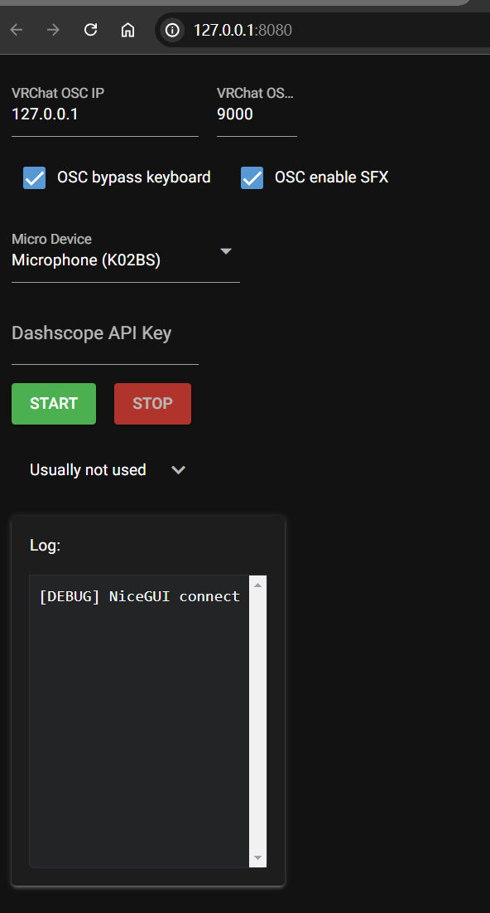

# 介绍

VRChatParaformerAsr会读取你的语音，再利用阿里云提供的服务将其转换成文字，最后通过OSC发送给vrchat。

用法：
1. 前往[Release界面](https://github.com/aoirusann/VRChatParaformerAsr/releases)下载`.exe`文件，并执行它
2. 然后浏览器应该会自动弹出访问`http://127.0.0.1:8080/`的网页（没弹出的话就自己开一个网页）：
3. 修改`Micro Device`，选择你使用的麦克风设备
4. 在`Dashscope API Key`处填入API Key（获取方法见后文）
5. 点`START`

附带一提两个勾选框的含义分别为：
* `OSC bypass keyboard`：不勾选的话好像会自动打开vrchat里的键盘？没测试过
* `OSC enable SFX`：不勾选的话vrchat里头上冒气泡的时候就不会有音效了

目前已知的bug：
* 点`STOP`时有时会闪退掉
* 还遇到什么别的bug的话请在[issues](https://github.com/aoirusann/VRChatParaformerAsr/issues)里提出，不过因为该项目只是我为朋友写的，在够用的情况下我并不一定会去修别的bug……

另外，
* 底层调用的模型主要是支持中文普通话，也支持一些英语
* 如果你是别的语种的使用者或者不在国内的话，我推荐你使用[VRCT](https://github.com/misyaguziya/VRCT)或者[vrc stt](https://vrcstt.com/)
* 本仓库的主要特点是底层调用的是阿里云专门为中文实时语音识别训练的模型（paraformer-realtime-v1），因此对中文的支持比较好，而且从国内访问的话网速很快
  * 我考虑过要不要给VRCT写个pull request的，但是因为paraformer-realtime-v1是实时语音识别模型，而非whisper那种离线的，两者的接口差太多了，所以没办法我就只好自己重新搓了个轮子


# 阿里云的Dashscope API Key获得方法

1. 打开dashscope控制台（该注册账号就注册账号，可能还得先实名认证）: https://dashscope.console.aliyun.com
2. 左边侧栏打开`API-KEY管理`，然后点`创建新的API-KEY`：
3. 把弹出来的那串字符串给复制下来保存好，它就是API key，就是你应该填进`Dashscope API Key`里的东西

备注：
* 请妥善保管，API key借给别人的话可能会导致欠款
* 阿里云提供了每个月36000秒的免费额度，常规的个人使用应该是够用了
	* 在dashscope控制台处（就是上面第一步那个链接）可以看到概略的使用情况：
	* 在调用统计处可以看到详细的使用情况：
	* 不过该统计是有延迟的（可能晚半天一天才会有统计结果），并非即时统计


# 常见问题

## 我的8080端口被占了怎么办？
1. 给`.exe`文件创建个快捷方式
2. 右键快捷方式，`目标`那里在.exe后面加上` --port 14512`（14512是你想换成的新端口）
3. 执行这个快捷方式


# 面向开发者

## 一些启动参数

命令行选项：
* `--title VRChat Paraformer Asr`
* `--host 0.0.0.0`
* `--port 8080`

环境变量：
* `STORAGE_KEY`：用于存储用户数据的，不指定的话就会根据机器码自动生成一个

## 调试

1. git clone这个库
2. `pip install -r requirements.txt`
3. `python main.py`

## 打包

安装pyinstaller，然后：

``` shell
nicegui-pack --onefile --name "VRChatParaformerAsr" main.py
```

打包后的文件为`dist\VRChatParaformerAsr.exe`
